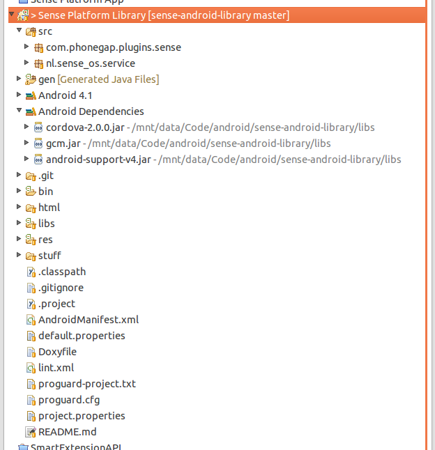

# Sense for Android apps

This is a tutorial for using the Sense Platform Library for including the Sense Platform into Android apps. It allows you to start the Sense service, and gives you access to configure the sensors you want to use.

## Configuring Eclipse
You need to install both the Android SDK and the Android Plugin for Eclipse. See the [Android Developers](http://developer.android.com/intl/fr/sdk/installing.html) website for a complete tutorial.

### Import Sense Library project in Eclipse

The Sense library project can be found at our [GitHub repository](https://github.com/senseobservationsystems/sense-android-library). There are two ways to import the code: you can use the EGit plugin for Eclipse (recommended), or you can checkout the code using some other git client.

#### Import using EGit

1.    In Eclipse, go to File > Import... Choose GIT > Projects from Git
2.    Select URI, enter the git repository for this project: `https://github.com/senseobservationsystems/sense-android-library.git`
3.    Next, select the branches you need. The most stable code is found in the master branch.
4.    Next, select the location for the repository and the branch to initially checkout, usually master. **Important:** Choose a location *outside* your workspace, as Eclipse can complain about overlapping paths otherwise.
5.    Next, choose Import existing projects. The "Sense Platform Library" project should be recognized automatically.
6.    Finish the wizard.

You can now continue to the next section to [Configure your project to use the library](#configureProject).

#### Import using other Git clients

1.    Download the source code from [GitHub repository](https://github.com/senseobservationsystems/sense-android-library). The most stable code can be found in the master branch.
2.    Do NOT put the folder inside you Eclipse workspace folder, a bug in Eclipse makes it impossible to import Android projects when they are already in the workspace directory.
3.    In Eclipse, import the project 'File -> Import...' Choose 'Android -> Existing Android code into Workspace' 
4.    Select the directory that contains the downloaded source code, i.e. the parent directory of the download.
6.    Finish the wizard.

### Configuring your project to use the library

1.    Right-click on your own Android project that will supply the GUI and select Properties.
2.    Go the the Android pane, and click "Add" in the Library section and add the Sense Library Project.
3.    Press OK to apply the changes.

## Using the library

### Native Android (Service binding)

TODO

### Web apps (PhoneGap)

We have created a special project to help you get started with creating a PhoneGap-based app that uses Sense. You can find the code at the [GitHub repo](https://github.com/senseobservationsystems/sense-android-phonegap). We recommend that you use this project as a starting point for your own app. Simply clone the project from the repository and start putting your HTML and JavaScript in the `assets/www/` folder inside the project.

The only part that you need to be careful about is the `sense_platform.js` file that contains the JavaScript part of our PhoneGap plugin.

1. In your HTML, import the `sense_platform.js` file. You can find in inside the [assets/www/ folder](https://github.com/senseobservationsystems/sense-android-phonegap/blob/master/assets/www/sense_platform.js).
2. The Sense platform methods are now accessible in JavaScript through `window.plugins.sense.*`.
3. When starting you app, make sure that you call `window.plugins.sense.init()` to initialize the plugin. A good place for this would be right after the `deviceready` event that PhoneGap features.

